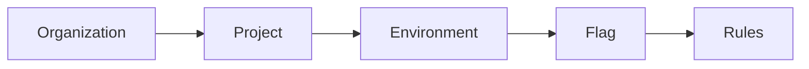
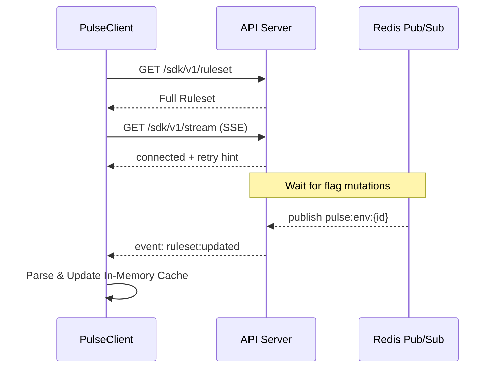

# Pulse

> Self-hostable, enterprise-grade feature flag service with real-time propagation.

## Architecture



**Key Features:**
- 🚀 Local evaluation SDK (zero per-request latency)
- ⚡ Real-time SSE + Redis Pub/Sub propagation
- 🔒 Multi-tenant with two-level RBAC
- 🎯 Consistent hashing for sticky rollouts
- 🔄 Optimistic locking for conflict-safe edits
- 📊 Custom recursive rule engine

## Tech Stack

- **API:** Fastify + Drizzle ORM + PostgreSQL + Redis
- **Dashboard:** Next.js 16 + Auth.js + TanStack Query
- **SDK:** TypeScript (ESM + CJS) with three-tier fallback
- **Monorepo:** Turborepo + pnpm workspaces



## Quick Start

```bash
# Start infrastructure
docker compose up -d

# Install dependencies
pnpm install

# Push DB schema
pnpm db:push

# Start all apps (uses .env.development)
pnpm dev
```

```

See `apps/docs/content/docs/self-hosting.mdx` for detailed production setup instructions.

## Project Structure

```
pulse/
├── apps/
│   ├── api/          # Fastify REST API
│   ├── dashboard/    # Next.js management UI
│   ├── example/      # NovaPay demo app
│   └── docs/         # Fumadocs site
├── packages/
│   ├── sdk/          # @pulse-flags/sdk (npm package)
│   ├── types/        # Shared Zod schemas
│   ├── ui/           # shadcn/ui components
│   └── tsconfig/     # Shared TS configs
└── plan.md           # Full specification
```

## Development

```bash
pnpm dev              # Start all apps
pnpm build            # Build all packages
pnpm test             # Run unit + integration tests
pnpm test:e2e         # Run Playwright tests
pnpm db:studio        # Open Drizzle Studio
```

## Documentation

Visit the **Pulse Documentation** (run the docs app or see the live deployment) for the Quickstart, full SDK Guide, and interactive API Reference.

See `plan.md` for the complete specification and architecture decisions.

## License

MIT
